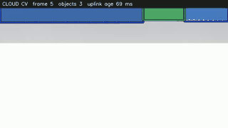
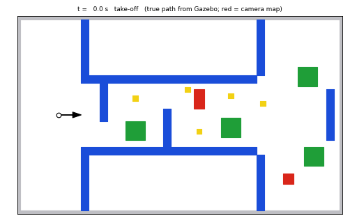

# drone_sim — Quadrotor Flyability & Endurance Simulation

Physics model and PX4/Gazebo software-in-the-loop simulation for our drone
team's quadrotor, built to answer one question before anyone prints a frame or
solders an XT90:

> **Will it fly, and for how long?**

It answers that two independent ways — a closed-form analytical model and a full
SITL flight — then cross-checks them against each other.

> [!WARNING]
> **Verification level: L0–L2 — simulation and software test only.**
> These results describe a *model* of the aircraft. They do **not** establish
> that the real aircraft is safe to build, power, or fly. No propeller has been
> spun and no pack discharged. **88% of the mass budget is still estimated
> rather than measured**, so treat every number as a band, not a verdict.

---

## Results at a glance

Estimated 3.12 kg AUW, 6S 6000 mAh, Raspberry Pi 5, 9×4.5 props:

| | Analytical | SITL measured | Δ |
|---|---:|---:|---:|
| Rotor speed (hover) | 8569 rpm | 8616 rpm | 0.5% |
| Thrust per motor | 779 g | 788 g | 1.2% |
| Hover power | 601 W | 570 W | 5.2% |

Two independent models agreeing to ~5% on power and ~1% on rpm is what makes
the rest of this trustworthy.

**It flies**, with thrust-to-weight ≈ 3.4 and hover at ~29% of available
thrust. Endurance is the constraint, not capability:

| Prop | Disc loading | Hover power | Endurance | vs. current |
|---|---:|---:|---:|---|
| **9×4.5** (current parts) | 19.0 kg/m² | 601 W | 10.7 min | — |
| 11×4.5 | 12.8 kg/m² | 469 W | 13.8 min | **+29%** |
| 13×4.4 | 9.2 kg/m² | 388 W | 16.8 min | **+57%** |

Wind is expensive: 6 m/s with 3 m/s gusts drove hover power from 570 W to
699 W (**+23%**) and cut endurance to ~9.2 min, with position-hold error
rising from 0.02 m to 0.93 m RMS.

## Factory hall mission (v2)

A 50 x 30 m factory hall: take off from the pad, fly a 27.5 m aisle whose five
obstacles each leave one gap (alternating sides), scan the room at the far end,
fly back and land. The drone knows nothing about the obstacles in advance:
camera frames go over an **emulated factory WiFi link to a cloud object
detector**, and the boxes that come back are turned into a map on the drone,
which plans a path through it.

| Drone camera + cloud boxes | True path over the hall plan |
|---|---|
|  |  |

**[Watch the 3D replay in your browser](https://shaashwatmishra203-creator.github.io/Drone_sim/replay/)**
(recorded run 15; needs GitHub Pages switched on, see docs/10 §8). The page
is `docs/replay/index.html` if you prefer to open it from a local clone.

| Complete runs | Run 11 | Run 12 (watched) | Run 15 (recorded) |
|---|---:|---:|---:|
| Mission time | 120.6 s | 142.0 s | 140.2 s |
| Closest approach (hull, Gazebo truth) | 0.523 m | 0.521 m | 0.540 m |
| Contact | none | none | none |
| Landing error from pad centre | 0.089 m | 0.083 m | 0.077 m |
| Range error, median / p90 | 2.1% / 8.7% | 1.9% / 8.3% | 2.2% / 9.3% |
| Detection recall (gate 0.90) | **0.758** | **0.787** | **0.786** |
| Cloud round trip, median | 117 ms | 118 ms | 117 ms |

**3 of 4 clean runs completed the mission**; run 14 got stuck on the way back
(dead-end escape added since, not yet exercised in flight). Clearance,
contact, landing and range gates pass; **detection recall fails**. Everything
is judged against Gazebo's true pose, not PX4's estimate. Full report:
[docs/10-factory-hall-v2.md](docs/10-factory-hall-v2.md) and
`out/drone_sim_report_v2.pdf`.

> [!CAUTION]
> **The v1 factory-mission results are retracted.** Waypoints were sent to PX4
> in Gazebo's frame without conversion, so the course was flown rotated 90
> degrees beside the walls, and every check shared the same error. Hover,
> thrust, power and endurance results are unaffected. See
> [docs/07-worklog.md](docs/07-worklog.md).

## Cloud vs edge compute

Perception and navigation must run **onboard**; map sharing belongs off-board.
Offload needs ~150 Mbps but the link delivers ~11 Mbps inside the room behind a
wall, latency rises from 69 ms to 578 ms, and a dropout blinds the aircraft
entirely. Raw stereo is 2654 Mbps and cannot leave the aircraft; the finished
map is a few hundred KB and travels freely - so edge compute is the
precondition for sharing maps with your other vehicles, not an alternative to
it. Full analysis in
[docs/09-compute-architecture.md](docs/09-compute-architecture.md).

**Update (v2):** the team chose cloud *object detection* with edge navigation
and safety. With the single Arducam and JPEG frames (5-7 KB at 10 Hz, about
0.5 Mbps) the uplink fits easily inside the 11 Mbps estimate. The 150 Mbps
figure above was for raw stereo depth. Safety never depends on the link: the
drone holds position if detections are more than 0.5 s old.


## Headline findings

1. **The 9-inch propellers have ~1% rpm margin.** ~15,900 rpm at full throttle
   against an estimated ~16,100 rpm ceiling, Mach 0.56 at the tip. 900 KV on 6S
   is a fast combination, and a 3115-size motor wants 11–13″. *That ceiling is
   the `145000/D` rule of thumb, not an HQProp figure — confirm it before
   treating this as settled.*
2. **The ZED cameras cannot run on a Raspberry Pi 5.** The ZED SDK requires a
   CUDA GPU; the Pi 5 has none. The perception stack is non-functional as
   specified, independent of flight dynamics.
3. **The SpeedyBee F405 cannot run a PX4 autonomy stack.** PX4 dropped F405
   support, so nothing validated here transfers to it.

Full reasoning, evidence quality and recommendations: **[docs/06-findings.md](docs/06-findings.md)**

---

## Quick start

Requires WSL Ubuntu 22.04 (or native Linux) with ROS 2 Humble, PX4 v1.18+ and
Gazebo Harmonic. See [docs/04-simulation-setup.md](docs/04-simulation-setup.md).

**1. Run the analytical model** — no simulator needed, answers go/no-go on its own:

```bash
python3 tools/sizing.py --config config/airframe.yaml --sweep-auw
```

**2. Generate and install the Gazebo models + PX4 airframes:**

```bash
python3 tools/gen_model.py --config config/airframe.yaml --install
```

```bash
cd ~/PX4-Autopilot && make px4_sitl_default
```

**3. Watch it fly** (opens a Gazebo window, then gives you the `pxh>` console):

```bash
bash scripts/watch.sh
```

Then type `commander takeoff` at the prompt.

**4. Run a scripted scenario** (headless, logs to CSV):

```bash
bash scripts/run_scenario.sh scenarios/hover_endurance.yaml 9x4.5 pi5
```

Add `GUI=1` to watch any scenario fly:

```bash
GUI=1 bash scripts/run_scenario.sh scenarios/hover_windy.yaml 9x4.5 pi5
```

**5. Run the full matrix, then regenerate the docs:**

```bash
bash scripts/batch.sh
```

```bash
python3 tools/gen_docs.py
```

---

## How it works

```
config/airframe.yaml ─┬─> tools/sizing.py    ──> analytical thrust/power/endurance
                      ├─> tools/gen_model.py ──> Gazebo SDF + PX4 airframe
                      └─> tools/gen_docs.py  ──> docs/01, docs/02

Gazebo Harmonic <──> PX4 SITL <──> MicroXRCEAgent <──> ROS 2 (drone_eval)
    (physics)      (flight ctrl)     (DDS bridge)       logger + mission runner
```

**One source of truth.** Every number the simulator uses is derived from the
same `config/airframe.yaml` the analytical model reads, so the two cannot
silently diverge. Change a mass in the config and the SDF, the airframe
parameters, the docs and the results all follow.

Gazebo's motor constants are derived rather than tuned:

```
motorConstant  = Ct · ρ · D⁴ / (4π²)
momentConstant = Cp · D / (2π · Ct)
```

For the 9×4.5 this yields `momentConstant = 0.0156` against the 0.016 PX4 ships
for its own x500 — two different routes to essentially the same number.

### Endurance is not `Wh ÷ W`

PX4's SITL battery drains linearly on **wall clock** (`SIM_BAT_DRAIN`),
ignoring the motors entirely, so its `BatteryStatus` is useless for endurance.
Instead `drone_eval/flight_logger` takes the actual per-motor commands PX4
produces, converts them to rotor speed and shaft power via the propeller
coefficients, and integrates a real battery model with an OCV curve and
internal-resistance sag — because a falling pack voltage demands more current,
which sags the voltage further.

---

## Layout

```
config/airframe.yaml      single source of truth — edit this, never generated files
tools/sizing.py           analytical model
tools/gen_model.py        config -> Gazebo SDF + PX4 airframe
tools/gen_docs.py         config + results -> docs/01, docs/02
tools/summarize_run.py    condense one flight log
scenarios/                flight profiles (hover, wind, cruise sweep, climb, forest)
scripts/watch.sh          fly it yourself with the GUI
scripts/run_scenario.sh   full stack bring-up for one scenario
scripts/batch.sh          the whole matrix
docs/                     documentation, 00–07
out/                      results
```

## Report

A formatted PDF covering everything below is generated from live project data by
`tools/gen_report.py`:

**[out/Drone_sim_v1.1_Report.pdf](out/Drone_sim_v1.1_Report.pdf)** (11 pages)

```bash
python3 tools/gen_report.py --out out/Drone_sim_v1.1_Report.pdf
```

## Documentation

- [docs/10-factory-hall-v2.md](docs/10-factory-hall-v2.md) - factory hall v2: cloud object detection, camera navigation, results and retractions

| Doc | Contents |
|---|---|
| [00-overview](docs/00-overview.md) | What this is, and what it can/cannot tell you |
| [01-parts-and-masses](docs/01-parts-and-masses.md) | Parts register, every mass with confidence *(generated)* |
| [02-specifications](docs/02-specifications.md) | Derived spec sheet, all variants *(generated)* |
| [03-methodology](docs/03-methodology.md) | The physics, assumptions, and gates |
| [04-simulation-setup](docs/04-simulation-setup.md) | Stack wiring, topics, QoS, troubleshooting |
| [05-results](docs/05-results.md) | Per-scenario results and cross-checks |
| [06-findings](docs/06-findings.md) | Verdict and prioritized recommendations |
| [07-worklog](docs/07-worklog.md) | What was run, what broke, what was decided |
| [08-factory-mission](docs/08-factory-mission.md) | Obstacle course, room scan, return to base |
| [09-compute-architecture](docs/09-compute-architecture.md) | Cloud vs edge compute for navigation |

`01` and `02` are regenerated from the config — edit `config/airframe.yaml`,
not those files.

---

## Changes this makes to the PX4 tree

Two, both minimal, both re-applied by re-running the generator after a PX4 update:

1. `ROMFS/.../airframes/CMakeLists.txt` — registers the generated airframes
   (IDs 22000–22005, inside PX4's reserved custom range).
2. `src/modules/uxrce_dds_client/dds_topics.yaml` — publishes
   `/fmu/out/actuator_motors`. PX4 ships it as an input-only topic, but the
   per-motor command is the only accurate source of propulsive power.
   Original backed up as `dds_topics.yaml.bak_drone_sim`.

## Gotchas worth knowing

| Symptom | Cause |
|---|---|
| Empty CSV | QoS mismatch — PX4 offers BEST_EFFORT, rclpy defaults to RELIABLE |
| No `/fmu` topics at all | XRCE agent died; needs `LD_LIBRARY_PATH=~/.local/lib` |
| Nodes frozen at t=0 | `use_sim_time:=true` with nothing publishing `/clock` |
| `Attitude failure (roll)` after arming | Wind stepped instead of ramped in after takeoff |
| Never reaches "Ready for takeoff" | Datalink/RC failsafe with no GCS attached |

PX4 1.18 appends message-version suffixes to some topics
(`vehicle_local_position_v1`, `vehicle_status_v4`) and not others, so both ROS 2
nodes resolve topic names against the live graph rather than hardcoding them.

## Next steps

1. **Weigh the aircraft** and update `config/airframe.yaml` — removes the
   largest uncertainty in every number here. Costs nothing.
2. **Confirm HQProp's real maximum rpm** — settles or dismisses the 9″ finding.
   Costs nothing.
3. **Move to 13″ propellers** — one prop set for +57% endurance.
4. Thrust-stand the motor/prop for real Ct/Cp — collapses the biggest remaining
   model error.
